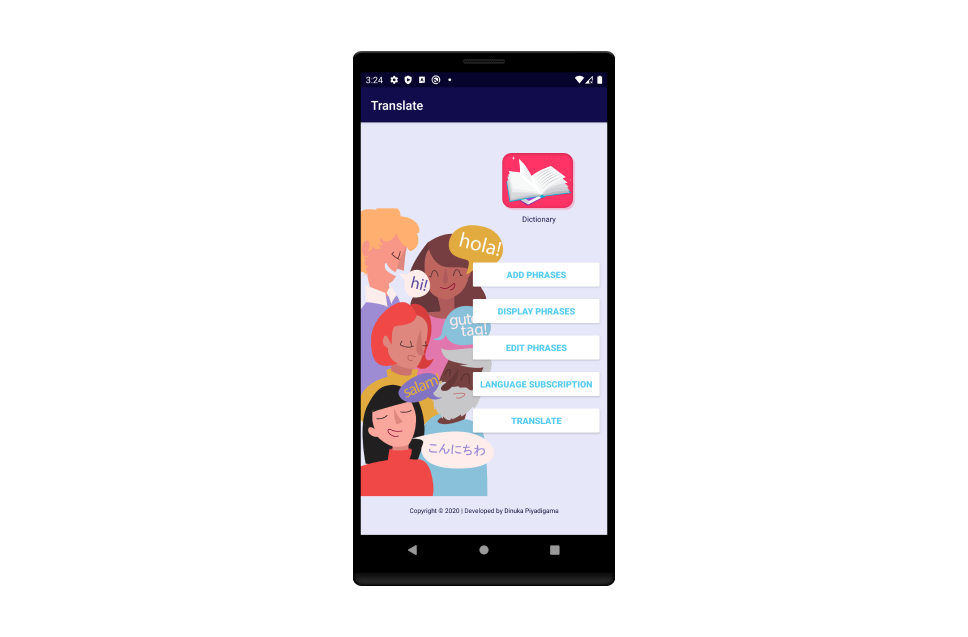
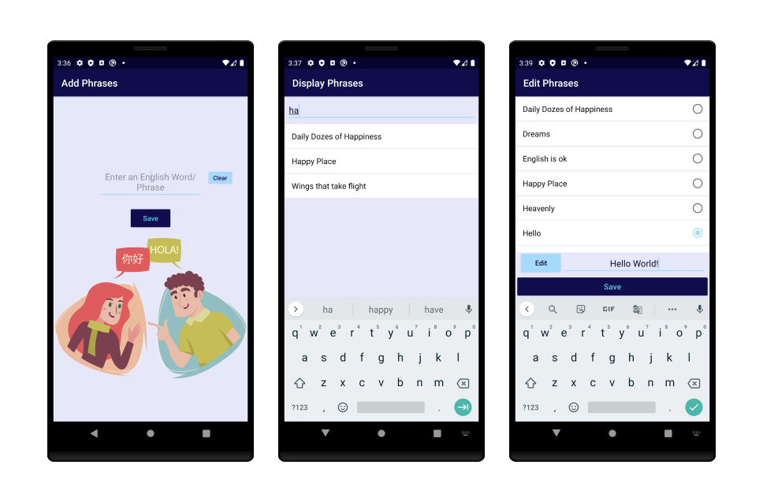
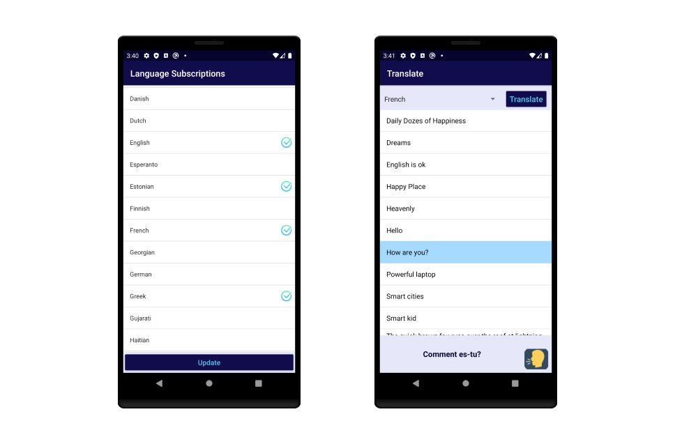
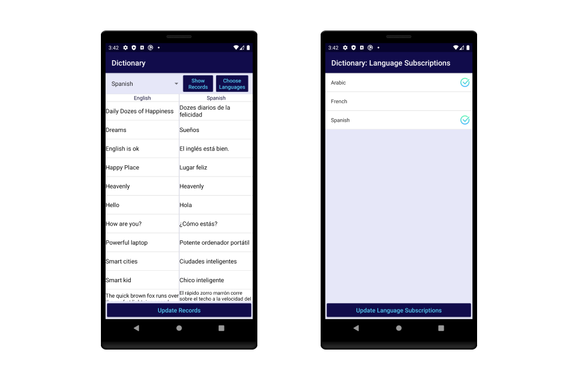
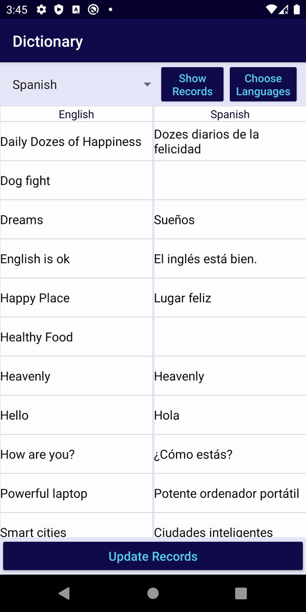
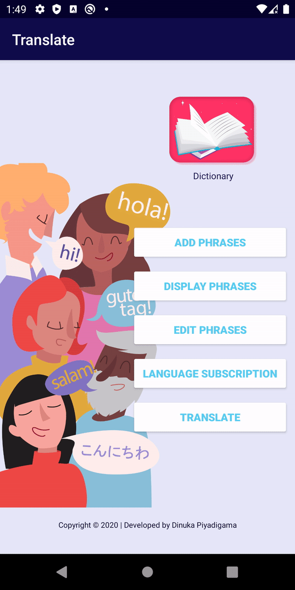
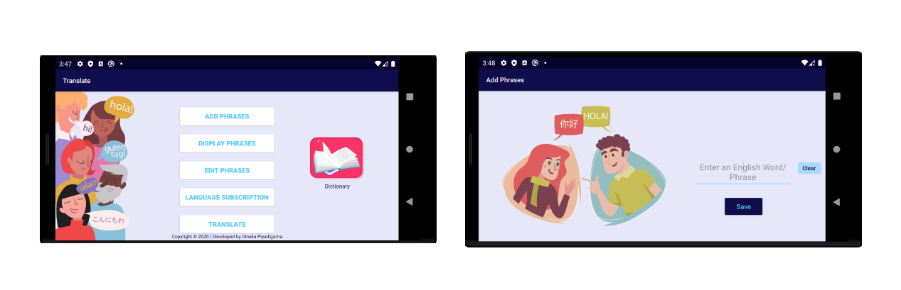

# Translate

### YOUR MOBILE FOREIGN LANGUAGE BUDDY

Translate is an app that'll help the user learn and practice different foreign languages.

The user can view the translated text of his/ her desired language and also listen to the pronunciation of the translated text. It's also possible for the user to save all the translations of the entered English words/ phrases in multiple languages for offline use.
 The game was made for Android OS as part of the Mobile Application Development module that I followed in my 2nd year.

## Technology behind Translate
1. Development IDE - Android Studio 3.6.2
2. Main development language – Java &amp; XML
3. Database - SQLite with **Room** Persistence Library
4. Tested AVDs - Pixel 3, Nexus 5X
5. Tested API Level - API 29

## Home Screen of Translate app
Displayed below is the Home screen of the **Translate** app.

The 6 options shown in the main screen opens the following screens:
- **DICTIONARY:** Save all translations of multiple languages for offline use and view them when offline.
- **ADD PHRASES:** Add new words/ phrases into the local database.
- **DISPLAY PHRASES:** Display all the words/ phrases that have been saved locally.
- **EDIT PHRASES:** Edit existing words/ phrases that have been saved.
- **LANGUAGE SUBSCRIPTION:** Allows the user to choose languages that the user desires to translate English words/ phrases into.
- **TRANSLATE:** Let's the user to view translations of chosen words/ phrases and listen to the pronunciation of the translated words/ phrases.

## Featured Screens of Translate app

## Basic functionalities developed in the app

 _**IBM Cloud Watson Translator** Web service & **IBM Cloud Watson TextToSpeech** Web service are used to translate English phrases and pronounce translations._
 
 Supported Translation Languages:
Arabic, Bulgarian, Catalan, Chinese (Simplified), Chinese (Traditional), Croatian, Czech, Danish, Dutch, English, Estonian, Finnish, French, German, Greek, Hebrew, Hindi, Hungarian, Irish, Indonesian, Italian, Japanese, Korean, Latvian, Lithuanian, Malay, Norwegian Bokmål, Polish, Portuguese, Romanian, Russian, Slovak, Slovenian, Spanish, Swedish, Thai, Turkish, Urdu, Vietnamese

## Extra functionalities that I developed in the app
- Search functionality of words based on any part of the word in Display Phrases section.
- Auto capitalization of words in add English: to make the database records appear clean.
- Use of the IBM API to get all new languages when the Language Subscriptions page is open and write into the database.
  - If new languages are added later, they will be added without requiring an update.
  - This is helpful when the user opens that app for the first time as well.

## Considerations taken when designing the UI/ UX of the app
- Stuck to a blue colour theme. Used light and dark alternatives of blue to clearly visualize the text & all other content of the application.
- Reasons for choosing blue as the core colour of the colour theme:
    - noted as the favorite color across all genders
    - symbolizes trust, loyalty, wisdom, confidence, intelligence, faith, truth, and heaven.
- Use of vector images to represent the functionalities and benefits of using the app.
- Provided the user with a feedback message for every input action with the use of TOAST messages.
- Use of Fragments to clearly separate Recycler view elements in scrollable lists.
- Displaying a loading animation when saving all translations of a chosen language into the database.
- Allow the user to slide back form any screen to the previous screen by swiping to the right from left.

#### App animations

    
    

## Good Practices of Design & Development that were followed
- Object Relational Mapping of data with the SQLite database (ORM).
- Saving time of creating and updation of data in the database.
- Use of Recycler view elements to display lists of data.
- Use of Android LiveData to receive records from the database.
- Use of AsyncTasks when writting into the database and retrieving translations from the IBM API.
- Use of TimeStampConverter as a TypeConverter to write dates & times into the database.
- Saved instance states when rotating the device and restored all view elements.
- Handled Network connectivity errors and language translation errors.

## Landscape Layouts

Landscape layouts were created for all the screens that required separate layouts for landscape orientation. Shown above are two of them.
 In all the landscape layouts, most of the user input areas were kept to the right and the image displays were kept to the left/ the centre of the screen as required. This makes it easier for the user to enter input and makes it comfortable for the user to view the images displayed as most people are used to reading from the left of the screen.

---

### Software used to design UI elements
- Figma
- Adobe Illustrator 

 
 ---
 
#### Third-party libraries used
[Sliding animations](https://github.com/r0adkll/Slidr)
https://codinginflow.com/tutorials/android/slidr
 
#### Referred links to integrate Room persistant library 
https://android.jlelse.eu/5-steps-to-implement-room-persistence-library-in-android-47b10cd47b24
https://medium.com/@tonia.tkachuk/android-app-example-using-room-database-63f7091e69af
https://github.com/anitaa1990/RoomDb-Sample/blob/master/app/src/main/java/com/an/room/ui/activity/NotesListActivity.java
https://codelabs.developers.google.com/codelabs/android-room-with-a-view

 
#### Referred links to upload the app to Google Play Store:
[https://medium.com/mindorks/upload-your-first-android-app-on-play-store-step-by-step-ee0de9123ac0](https://medium.com/mindorks/upload-your-first-android-app-on-play-store-step-by-step-ee0de9123ac0)
 [How To Upload Android App on Google Play Store | Publish App on Play Store](https://www.youtube.com/watch?v=8v0r_6mYgF8)
 [How To Upload Android App on Google Play Store | Publish App on Play Store Part-2](https://www.youtube.com/watch?v=YWfKnswgd4k)
 [Generate and sign apk to upload to playstore](https://developer.android.com/studio/publish/app-signing#sign-apk)

#### Privacy policy generator
[https://app-privacy-policy-generator.firebaseapp.com](https://app-privacy-policy-generator.firebaseapp.com/)

#### Privacy policy hosted location
[https://translate-0.flycricket.io/privacy.html](https://translate-0.flycricket.io/privacy.html)
